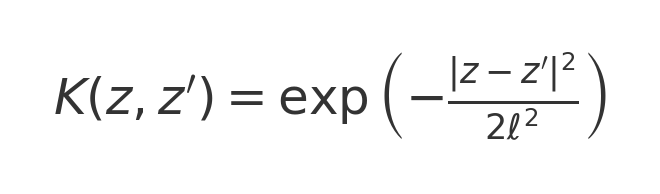
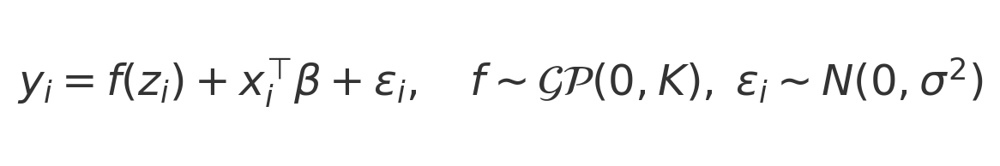
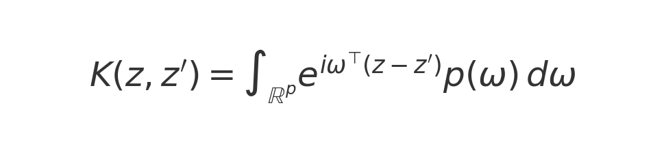
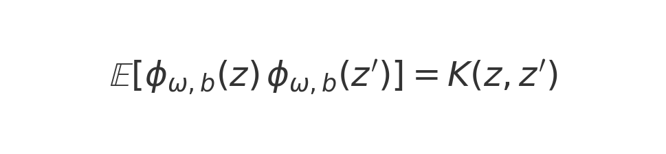
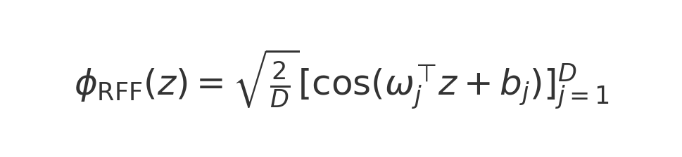
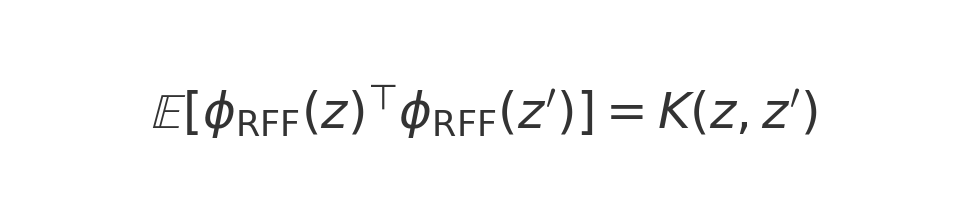
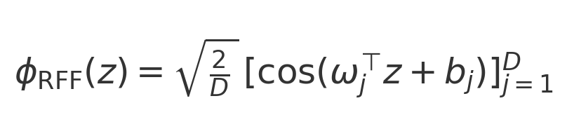
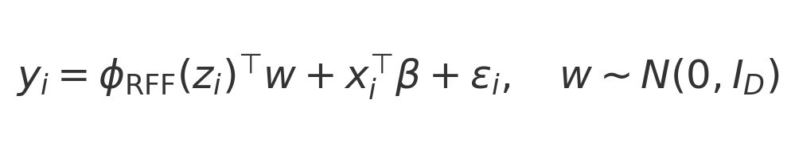
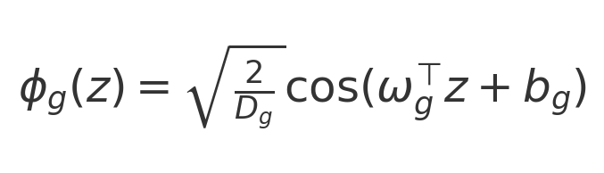
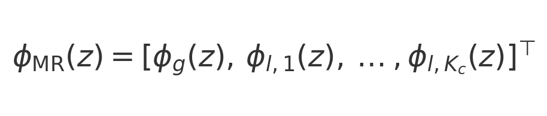

# Kernel Comparison: Full BKMR, RFF-only, MR-QMC-IFF

## Introduction

This script compares three kernel-based methods for modeling a continuous outcome y as a function of exposures Z∈ℝⁿˣᵖ and covariates X∈ℝⁿˣᵠ, focusing on capturing non-linear and interaction effects while balancing cost and approximation error.

### 1. Full BKMR

Exact Gaussian-process regression with covariance:

Fitting the model:

MCMC via `kmbayes` yields full posterior draws of f, enabling direct inference on exposure interactions.

### 2. RFF-only (Random Fourier Features)

By Bochner’s theorem, any shift-invariant kernel can be expressed as:

with the spectral density:

Defining the random feature map $\phi_{\omega,b}(z)=\sqrt{2}\cos(\omega^\top z + b)$, we have the expectation:

Approximate via $D$ Monte Carlo samples:

so that:

Monte Carlo approximation of the Gaussian kernel via Bochner’s theorem:

Bayesian linear model in feature space:

Cost: 

Error: 

### 3. MR-QMC-IFF

Global Quasi-Monte Carlo features:

Combined global and local features:

Error: 

, 

variance reduced via clustering, BKMR-level accuracy with fewer features.

## Summary

- **Full BKMR**: exact GP inference:
-
- Cost:
-
- .
-
- **RFF-only**: MC kernel approximation:
-
- Cost:
-
- ,
-
- Error:
-
- .
-
- **MR-QMC-IFF**:
- QMC+local features:
-
- Error: 

scalable to large n and p.
