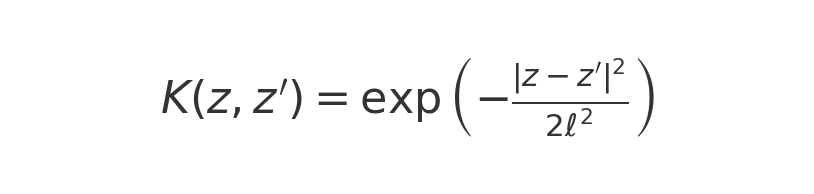
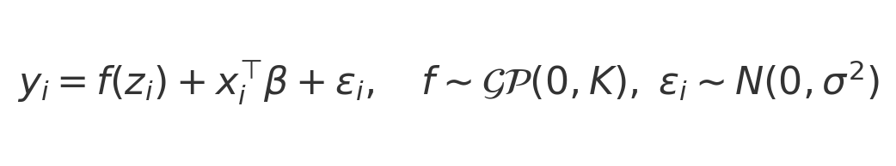
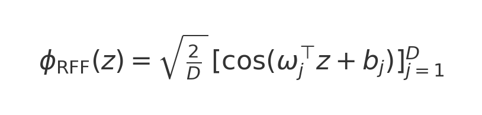
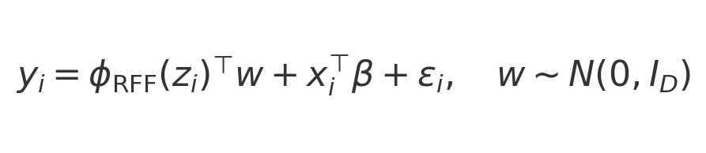
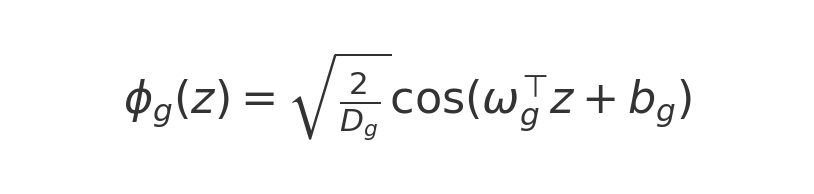
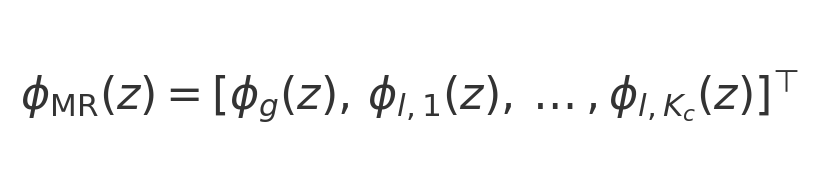

# Kernel Comparison: Full BKMR, RFF-only, MR-QMC-IFF

## Introduction

This script compares three kernel-based methods for modeling a continuous outcome y as a function of exposures Z∈ℝⁿˣᵖ and covariates X∈ℝⁿˣᵠ, focusing on capturing non-linear and interaction effects while balancing cost and approximation error.

### 1. Full BKMR

Exact Gaussian-process regression with covariance:

Fitting the model:

MCMC via `kmbayes` yields full posterior draws of f for interaction inference.

### 2. RFF-only (Random Fourier Features)

Monte Carlo kernel approximation:

Bayesian linear model in feature space:

Cost: O(nD²), error: O_p(D⁻¹ᐟ²).

### 3. MR-QMC-IFF

Global Quasi-Monte Carlo features:

Combined global and local features:

Error: O(D⁻¹), variance reduced via clustering, BKMR-level accuracy with fewer features.

## Summary

- **Full BKMR**: exact GP inference, O(n³) cost.
- **RFF-only**: MC kernel approximation, O(nD²) cost, O_p(D⁻¹ᐟ²) error.
- **MR-QMC-IFF**: QMC+local features, O(D⁻¹) error, scalable to large n and p.
