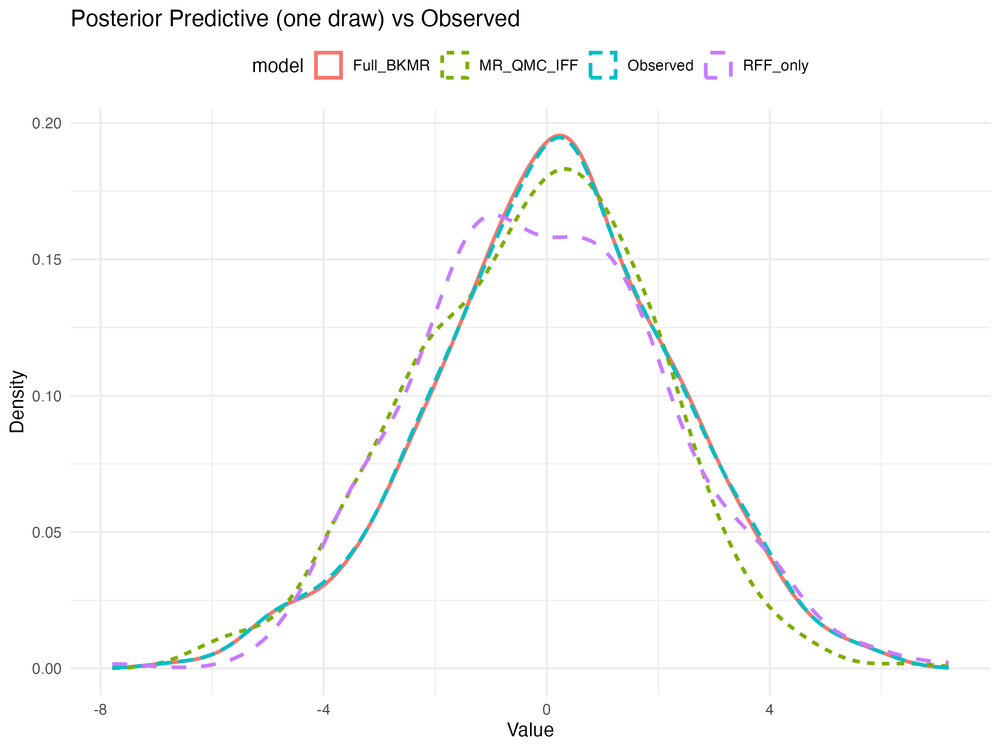

# Kernel Comparison: Full BKMR, RFF-only, MR-QMC-IFF

## Introduction

This script compares three kernel-based methods for modeling a continuous outcome y as a function of exposures Z∈ℝⁿˣᵖ and covariates X∈ℝⁿˣᵠ, focusing on capturing non-linear and interaction effects while balancing cost and approximation error.

### 1. Full BKMR

Exact Gaussian-process regression with covariance:

Fitting the model:

MCMC via `kmbayes` yields full posterior draws of f, enabling direct inference on exposure interactions.

### 2. RFF-only (Random Fourier Features)

By Bochner’s theorem, any shift-invariant kernel can be expressed as:

with the spectral density:

Defining the random feature map $\phi_{\omega,b}(z)=\sqrt{2}\cos(\omega^\top z + b)$, we have the expectation:

Approximate via $D$ Monte Carlo samples:

so that:

Then, the y can be predicted by Bayesian linear model in feature space:

With Cost: 

and Error: 

### 3. MR-QMC-IFF (Mixed-Resolution Quasi-Monte Carlo + Intra-Cluster Feature Fusion)

In this case, we considered both global and local features: 

Using a Sobol sequence, draw feature from Quasi-Monte Carlo:

Local QMC: cluster Z into K groups by k-means; Within each cluster K, generate local D Sobol-based features. 

Combined global and local features:

With Error: 

, 

### Why MR-QMC-IFF?

1. Faster convergence: QMC features achieve deterministic approximation error O(D-1), up to log factors) versus Monte Carlo’s O(D-1.5).
  
2. Variance reduction: Localizing features by cluster tailors the approximation to each data subregion, further lowering variance per feature.
   
3. Efficiency: MR-QMC-IFF matches Full BKMR’s predictive accuracy with far fewer total features than RFF-only, cutting both memory and runtime without sacrificing accuracy.

### Summary

Full BKMR: exact posterior inference of interactions O(n^3) cost

RFF-only: Monte Carlo kernel approximation, cost O(nD^2)

MR-QMC-IFF: mixed Quasi-Monte Carlo + cluster-localized features,high accuracy with lower feature dimension—ideal for scaling GP-like models to large n and p. 

### Comparison with three methods within simualted dataset

Simulated dataset: 

n = 2000, number of exposure (p) = 5， covirate = 3

Assuming non-linear fucntion h <- function(Z) {
  rowSums(sin(2*pi*Z)) + apply(Z, 1, prod)
}

#beta for covirate
beta <- c(1.0, -1.0, 0.5)

#Generate Y (outcome)

y  <- h(z) + x %*% beta + rnorm(n, sd = 0.1)

### posterior_predictive_density

